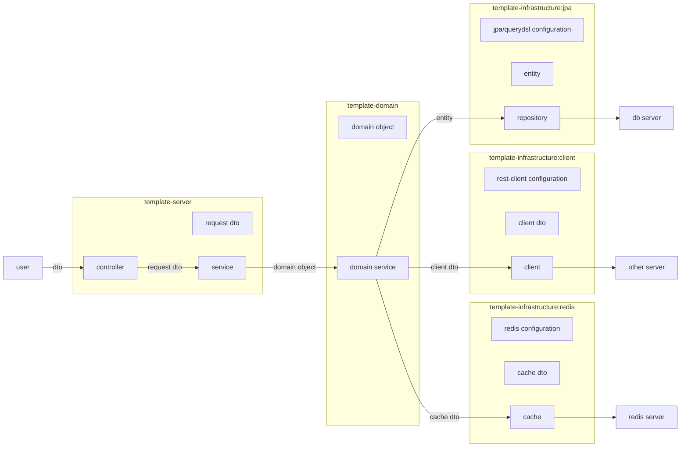
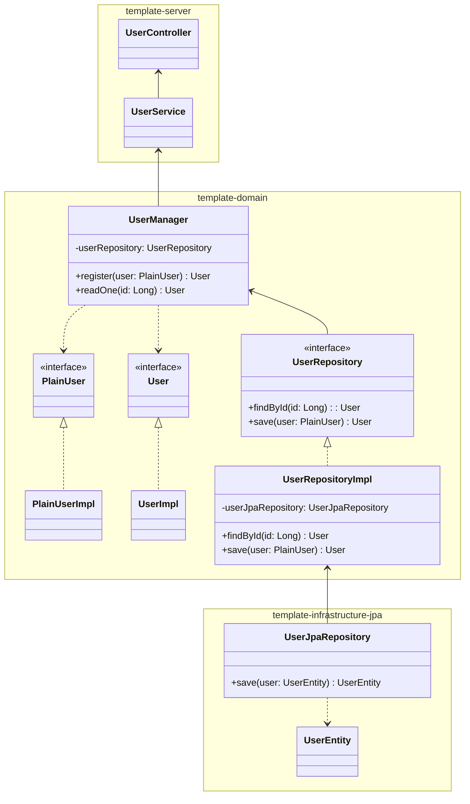

# Springboot template

SpringBoot 기반 서버 구현을 위한 템플릿입니다.

### How to use
1. Clone project
    ```
   g clone git@github.com:disdong123/springboot-template.git
   ```
2. [Set conventional commits](https://github.com/disdong123/oauth2-proxy-ko/blob/main/docs/convention.md)
    ```
   # Install dependencies
    npm install @commitlint/cli @commitlint/config-conventional --save-dev

    # Configure commitlint
    echo "module.exports = { extends: ['@commitlint/config-conventional'] };" > commitlint.config.js
    
    # Install husky
    npx husky init
    
    # Configure commit-msg
    echo "npx --no -- commitlint --edit \$1" > .husky/commit-msg
    
    # Remove pre-commit if you don't need
    rm .husky/pre-commit
   ```
3. [Set environment variables for version catalog](https://github.com/disdong123/version-catalog)


### Architecture
#### Flow



#### Implementation example


#### Description